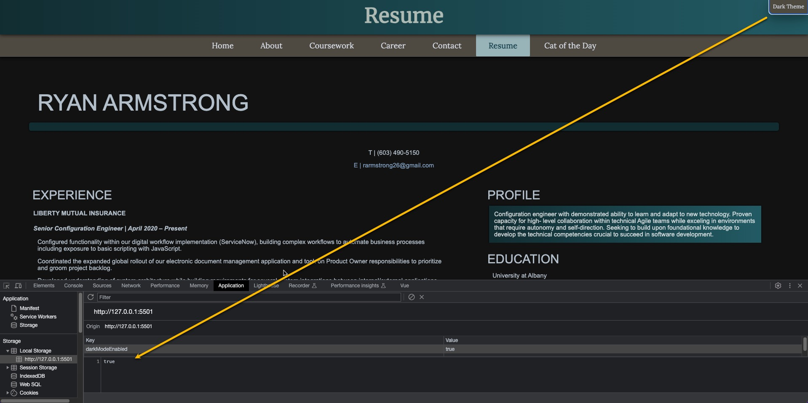
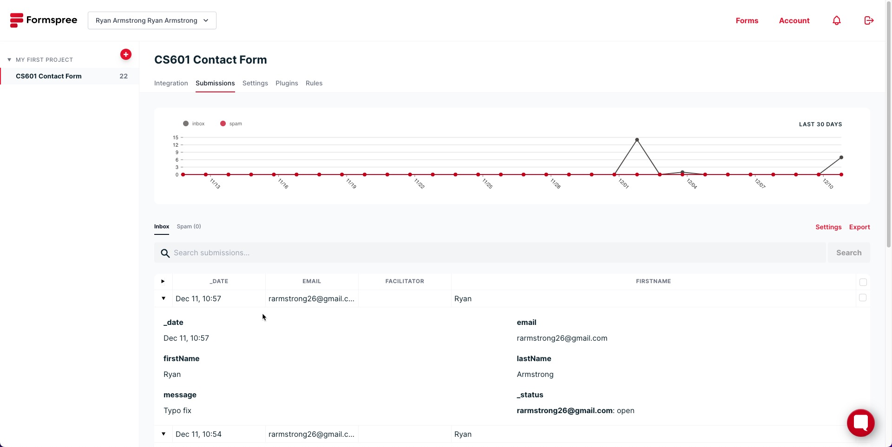

# TERM PROJECT - RYAN ARMSTRONG

### ABOUT

This is a portfolio site to showcase my web development skills.

### INSTALLATION

Access hosted page: https://rarmstro26.github.io/CS601_Term_Project/

Or

Download and extract 'CS601_Term_Project_Armstrong' which contains files needed to view the site locally.
 
 
| HTML            | CSS           | JS              |
| :-------------: |:-------------:| :--------------:|
| about.html      | contact.css   | contact_form.js |
| career.html     | main.css      | dark_mode.js    |
| contact.html    | resume.css    | fetch_cat.js    |
| coursework.html |               |                 |
| index.html      |               |                 |
| random_cat.html |               |                 |
| resume2.html    |               |                 |

Github repo: https://github.com/rarmstro26/CS601_Term_Project

### SUPPORT

Ryan Armstrong rarmstro@bu.edu

---

### PROBLEMS & LEARNINGS

> Definitely worked through quite a bit of trial and error with flex-box and general layout considerations. 

> Getting my 'sticky nav' to work as expected was a headache.

> Conflicting CSS files and specificity.

> Learned alot building out a persistent dark mode toggle.

> Got some great practice with fetch post & get.

> With more time I would have liked to add a hamburger menu for mobile, add a projects page, and build more with Vue.

---

### ABOVE & BEYOND

#### SITEWIDE:

> Added a favicon for added interest in browser

> Dark Theme toggle that persists as user navigates the site - onclick event calls a JS function which sets a 'dark-mode' value in local storage and
an onload event handler that handles persistence - retrieves 'darkModeEnabled' value and checks truth to set 'dark-mode' again (persist) or remove if not
set from previous page. I spent a LOT of time on this one.

> Reusable Vue component created to handle my uniform site navigation menu which dynamically handles setting of 'active' class for each page.

> Sticky navigation: on scroll, my 2nd layer navigation buttons 'stick' while my site header collapses for ease of use. I struggled mightily with conflicting CSS for this one and I likely should have started from scratch with how I identified my layout components but this was mostly trial and error getting ONLY my
nav menu to remain 'sticky'.

> Transition effects used for menu hover states and image gallery for UX appeal.

> Tablet/mobile responsiveness: menu collapses to column (I really wanted to get a hamburger built but I ran out of time), images/textboxes/iframes/dark mode toggle all scale down to window and don't require side-scrolling.

> All links open in new tab.

#### INDEX/HOME:

> Set up an image gallery with some cool border and hover effects that perform a small 'zoom' on hovered image with a transition effect to give some interactivity. 

> Coding 'text-box' to give some visual interest to text and ended up stubmling upon this 'linear-gradient' background effect that I ended up reusing as a theme throughout the site for the header/footer and other similar boxes.

> Styled a custom viewing-container for my embedded youtube iframe.

#### ABOUT:

> Dynamic image preview for a link text included in my about me section using a JS event listener on mouseover which displays a formatted image from where
the link takes the user. I kept this JS within the about.html given it's brevity and not really fitting content-wise into my existing external JS files.

> Hobbies are in a styled UL with background gradient.

> An enhanced image gallery with the same hover/border effects which also contain image description text and link out to full-size images when clicked - I was happy about how that came out.

#### COURSEWORK:

> Built a couple of really styled tables with banded rows and border effects. Definitely inspired by the advanced table example by W3 schools I want to note for the hover and banding styling. Reused my gradient background theme here for header rows.

> Custom styled a horizontal rule divider that I ended up reusing quite a bit to provide some visual separation between text sections, etc.

> Styled the 'aruba' image at the bottom of the page giving it a kindof polaroid border effect I thought was cool.

#### CAREER:

> Flexbox layout for 2 column left-image right-text allowing the text to fill out the remainder of width which came out really responsive. I struggled with layout and trying to implement flex correclty early on so was looking for ways to practice and happy how this came out.

> Styled linkedIn faux-button with the square logo - had to rework this after the validator didn't like my button inside of an anchor.

#### CONTACT:

> I used our form homework as a starting point here and expanded in a few ways. I built out some additional regex validation, added and styled a textarea message box, added a dynamic character count (max 100 validation), and a reset button that clears the form and any errors.

> Made use of HTML built ins in addition to full regex validation and added and styled placeholder text for guidance.

> I wanted to make the form feel more real so I looked into some free-to-use backends to handle form submission and came across Formspree. I ended up setting up fetch to post the form body so I could monitor the dashboard and send email notifications to my personal account. So if you submit the form you'll see a success message alert while also kicking off my clear function to reset the form on successful submit. Another page where I spent a LOT of time on.

NOTE: I purposely didn't add dark-mode toggle to this page given the background contrast. 

#### RESUME:

> My first version was just an embedded PDF version of my resume - which I think looked nice but I wanted more practice with layout/formatting. I took the opportunity to create a standalone CSS file just for the page.

> I started with an basic HTML export from Adobe of my resume and setup a flexbox 2 column two thirds, one third layout. 

> Added an additional mobile media query to handle responsiveness with a lot of text.

#### CAT OF THE DAY:

> I think you mentioned during a saturday class about finding free APIs to hook up to and I liked that idea. I found thecatapi.com which allows you
to get a random cat image and ran with it. Again here started from our homework as a starting point and used fetch to dynamically update the DOM
displaying a cat image when the user clicks the button as well as displaying the 'Random cat image from' text. Just good practice.

